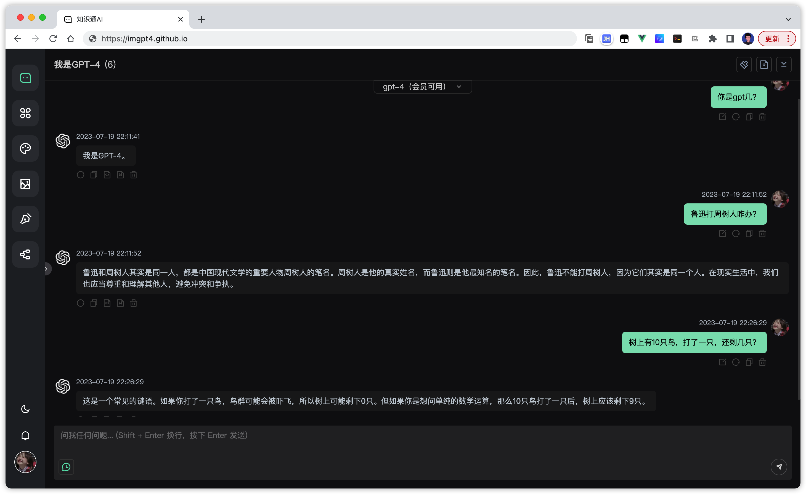

# 知识通AI

> [知识通AI](https://openai6.github.io) 已经上线~ 

已支持文心一言、通义千问、科大讯飞、智谱等模型

与 AI 对话，基于 ChatGPT [OpenAI GPT-3.5 Turbo 和 GPT-4 API]并提供免费体验密钥.

绘画 基于Midjourney

在线体验：[https://openai6.github.io](https://openai6.github.io)

## 特性

- 快得批爆
- 支持随机生成预设场景（100+）
- 支持缓存会话
